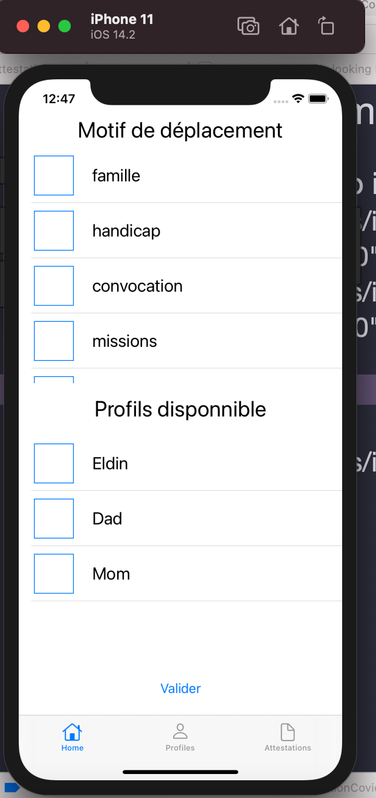

# AttestationCovid

Help creating certificate when you need to go out during lockdown in France,
certificate is needed to prove what was your raison to go out

The idea was simple, the official online generating certificate had not the possibility to create multiple profils ( add all your infos name, birthday) and can only generate one pdf for one profil. This app add the possibility to create multiple profils and select them to generate certificate (in PDF) in a easy way. when all the profils are created, you have just to select the raison and the profils and you will get all the certificate.

## Purpose of this app

Trying knew things and improving my knowledge of swift and building apps.

learnings/improving : 
- Learn more with SwiftUI
- Try Composable Architecture
- Try PDFKit
- Improve in data request
- Improve in persistant data
- improve in buildings app

## Tech used

-  [SwiftUI](https://developer.apple.com/xcode/swiftui/)
-  [PDFKit](https://developer.apple.com/documentation/pdfkit)
-  [Defaults](https://github.com/sindresorhus/Defaults)
-  [Composable Architecture](https://github.com/pointfreeco/swift-composable-architecture)

## App Advancement

### 9 January 2021

#### Home view

#### List profils View

#### On a profil View

#### Certificates View

